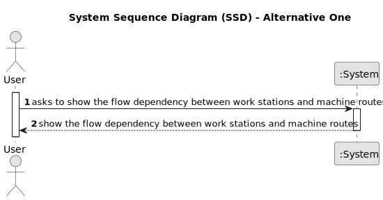

# USEI07 - Produce a listing representing the flow dependency between machines

## 1. Requirements Engineering

### 1.1. User Story Description

As a user of the system, I want to create a list representing the flow dependency between machines.

### 1.2. Customer Specifications and Clarifications 

**From the specifications document:**

> The listing should be sorted in descending order of processed items.

**From the client clarifications:**

> **Question:** Good afternoon, on US7 the following is mentioned: "The listing should be sorted in descending order of processed items." My question is in relation to the example given:
a: m1 -> m5
b: m1 -> m2 -> m4 -> m5
c: m1 -> m2 -> m3 -> m5
d: m1 -> m4 -> m3
e: m1 -> m3 -> m5
After the complete processing of these items, the following listing should be produced:
m1 : [(m2,2),(m5,1),(m3,1),(m4,1)]
m2 : [(m4,1),(m3,1)]
m3 : [(m5,2)]
m4 : [(m5,1),(m3,1)]"
In this example, is the list already sorted in descending order of processed items?
If the answer is yes, then I really don't understand the grading criteria.
>
> **Answer:** In this example,
m1 : [(m2,2),(m5,1),(m3,1),(m4,1)]
m2 : [(m4,1),(m3,1)]
m3 : [(m5,2)]
m4 : [(m5,1),(m3,1)]
the number of items processed is:
5
2
2
2
So, I believe it is sorted.

### 1.3. Acceptance Criteria

* **AC1:** There should be machines.
* **AC2:** There should be items.
* **AC3** The listing should be sorted in descending order of processed items.

### 1.4. Found out Dependencies

* There is a dependency on "USEI02 - Implement a simulator that processes all the items according" as there must be a simulator.

### 1.5 Input and Output Data

**Input Data:**

* Typed data:
	
* Selected data:

**Output Data:**

* List of items that show in which machines it did use
* List of dependencies between machines in order
* (In)Success of the operation

### 1.6. System Sequence Diagram (SSD)

**_Other alternatives might exist._**

#### Alternative One

### 1.7 Other Relevant Remarks

