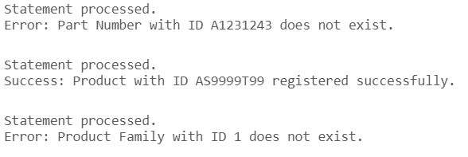

# USBD16 -  Register a product in the system

### 1. User Story Description

>  As a Production Manager, I want to register a product in the system.

### 2. Resolution
>**AC1:** Minimum expected requirement: demonstrated with data imported from the
   legacy system.
> 
>**AC2:** A function should be used to create the product and to return success or an error.

#### 2.1 Explanation
> This script defines a PL/SQL function called register_product, which registers a product in the Product table after performing a series of validations. The function accepts the product ID, product family ID, product name, and description as inputs.
>
>The first validation ensures that the provided product family ID exists in the Prod_Family table. If the family ID does not exist, the function returns an error message stating that the product family is invalid. The second validation checks if the given product ID exists as a part number in the Part table. If the part number does not exist, the function returns an error message indicating that the part is invalid.
>
>If both validations pass, the function attempts to insert the product details into the Product table. Upon successful insertion, it returns a success message with the product ID. The function includes error handling to manage duplicate entries; if a product with the same ID already exists, it returns a specific error message. Any other unexpected errors are also handled, with the function returning a generic error message describing the issue.

      CREATE OR REPLACE FUNCTION register_product (
          p_product_id Product.PRODUCT_ID%TYPE,  -- Use the type of PRODUCT_ID column from Product table
          p_prod_family_id Product.Prod_FamilyFAMILY_ID%TYPE,  -- Use the type of Prod_FamilyFAMILY_ID column
          p_name Product.NAME%TYPE,  -- Use the type of NAME column from Product table
          p_description Product.DESCRIPTION%TYPE  -- Use the type of DESCRIPTION column from Product table
      )
      RETURN VARCHAR2
      IS
         v_exists NUMBER(1);  -- Variable to check if the Product Family exists
         result_message VARCHAR2(255);  -- Variable for the result message
      BEGIN
         -- Step 1: Validate if the Product Family ID exists
         SELECT COUNT(1)
         INTO v_exists
         FROM Prod_Family
         WHERE FAMILY_ID = p_prod_family_id;
      
         IF v_exists = 0 THEN
             RETURN 'Error: Product Family with ID ' || p_prod_family_id || ' does not exist.';
         END IF;
      
         -- Step 2: Validate if the Part ID exists
         SELECT COUNT(1)
         INTO v_exists
         FROM Part
         WHERE PARTNUMBER = p_product_id;
      
         IF v_exists = 0 THEN
             RETURN 'Error: Part Number with ID ' || p_product_id || ' does not exist.';
         END IF;
      
         -- Step 3: Insert the product into the Product table
         BEGIN
             INSERT INTO Product (PRODUCT_ID, Prod_FamilyFAMILY_ID, NAME, DESCRIPTION)
             VALUES (p_product_id, p_prod_family_id, p_name, p_description);
      
             -- Step 4: Return success message
             result_message := 'Success: Product with ID ' || p_product_id || ' registered successfully.';
             RETURN result_message;
      
         EXCEPTION
             WHEN DUP_VAL_ON_INDEX THEN
                 RETURN 'Error: Product with ID ' || p_product_id || ' already exists.';
             WHEN OTHERS THEN
                 RETURN 'Error: ' || SQLERRM;
         END;
      END;
      /

      --FOR TESTES
      INSERT INTO Part (PARTNUMBER, DESCRIPTION, TYPE) VALUES ('AS9999T99', 'TESTE', 'Product');
      
      DECLARE
         result_message VARCHAR2(255);
      BEGIN
         result_message := register_product('A1231243', 130,'TESTE', 'TESTE');
         DBMS_OUTPUT.PUT_LINE(result_message);  -- Output the result message
      END;
      /
      
      DECLARE
         result_message VARCHAR2(255);
      BEGIN
         result_message := register_product('AS9999T99', 130,'TESTE', 'TESTE');
         DBMS_OUTPUT.PUT_LINE(result_message);  -- Output the result message
      END;
      /
      
      DECLARE
         result_message VARCHAR2(255);
      BEGIN
         result_message := register_product('AS9999T99', 1,'TESTE', 'TESTE');
         DBMS_OUTPUT.PUT_LINE(result_message);  -- Output the result message
      END;
      /

### 3. Resolution

>

>[See results in a CSV file](csv_result/USBD16.csv)

