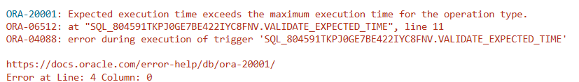

# USBD23 - Expected execution time of an operation not greater than the maximum execution time of every workstation type where it may be run

### 1. User Story Description

>  As a Production Manager, I want to make sure that the expected execution time of an operation is not greater than the maximum execution time of every workstation type where it may be run. A trigger should be developed to avoid this issue in both insert and update operations.

### 2. Resolution
>**AC1:** Minimum expected requirement: demonstrated with data imported from the
legacy system.
> 
>**AC2:** A trigger should be developed to
avoid this issue in both insert and update operations.

>This trigger is designed to ensure that the EXPECTEDTIME for an operation in the Operation table doesn't pass the MAX_EXECUTIONTIME that workstation_type has defined.
>
>When an operation is being added or updated, the trigger calculates the maximum allowed execution time for the operation's type. It does this by querying the Workstation_Type and Workstation_Type_Operation_TYPE tables, which define the relationship between workstation types and operation types, and retrieves the MAX_EXECUTIONTIME associated with the operation type in question.
>
>The trigger then compares the provided EXPECTEDTIME in the operation (:NEW.EXPECTEDTIME) to the retrieved maximum execution time. If the expected time exceeds the allowed maximum, the trigger raises an application error with a specific message, stopping the database from completing the insert or update.

    CREATE OR REPLACE TRIGGER validate_expected_time
    BEFORE INSERT OR UPDATE ON Operation
    FOR EACH ROW
    DECLARE
    max_time NUMBER;
    BEGIN
    SELECT MAX_EXECUTIONTIME
    INTO max_time
    FROM Workstation_Type Wt
    JOIN Workstation_Type_Operation_TYPE WtOt ON WtOt.Workstation_TypeWS_TYPE_ID = Wt.WS_TYPE_ID
    WHERE Operation_TYPEOPTYPE_ID = :NEW.Operation_TYPEOPTYPE_ID;
    
        IF :NEW.EXPECTEDTIME > max_time THEN
            RAISE_APPLICATION_ERROR(-20001,'Expected execution time exceeds the maximum execution time for the operation type.');
        END IF;
    END;
    /
    
    INSERT INTO Operation (OPERATION_ID, DESCRIPTION, EXPECTEDTIME, BOOProductPRODUCT_ID, Operation_TYPEOPTYPE_ID, NEXTSTEP)
    VALUES (9999, 'Teflon painting', 3300, 'AS99999S99', 5671, NULL);
    

### 3. Resolution

>

>[See results in a CSV file](csv_result/USBD23.csv)

