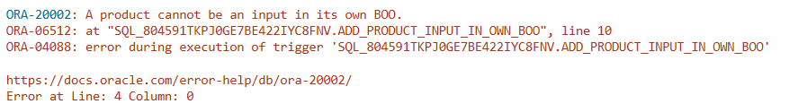

# USBD24 - Add a product as an input in its own BOO

### 1. User Story Description

>  As a Production Manager, I don’t want it to be possible to add a product as an input in its own BOO. A trigger should be developed to avoid such circular references. This doesn’t apply to the BOOs of subproducts.

### 2. Resolution
>**AC1:** Minimum expected requirement: demonstrated with data imported from the
legacy system.
> 
>**AC2:** A function should return a cursor with all the product
parts and their quantity. The individual components should be included when a
part is a subproduct made at the factory

>This script defines a PL/SQL function called list_parts_used_product, which returns a cursor containing a list of parts used by a specific product, along with their quantities. The function accepts a product_id as input and opens a SYS_REFCURSOR to retrieve the relevant data.
>
>The first part of the query selects parts directly associated with the product by joining the BOO_INPUT and Operation tables. It sums the quantities for each part number and groups the results by part number.
>
>The second part of the query handles parts related to the product indirectly. It selects parts from the BOO_OUTPUT table, ensuring that parts are not linked directly to the product but are part of a more complex relationship. The query joins BOO_OUTPUT and BOO_INPUT and filters based on a subquery that identifies parts associated with the subproducts through specific operations. This query also sums the quantities and groups them by part number.

    CREATE OR REPLACE TRIGGER add_product_input_in_own_BOO
    BEFORE INSERT OR UPDATE ON BOO_INPUT
    FOR EACH ROW
    DECLARE
        ProductID Operation.BOOProductProduct_ID%TYPE;
    BEGIN
        SELECT BOOProductProduct_ID
        INTO ProductID
        FROM Operation O
        WHERE :NEW.OperationOPERATION_ID = O.OPERATION_ID;

        IF ProductID = :NEW.PartPARTNUMBER THEN
            RAISE_APPLICATION_ERROR(
                -20002,
                'A product cannot be an input in its own BOO.'
            );
        END IF;
    END;
    /
    
    INSERT INTO BOO_INPUT (OperationOPERATION_ID, PartPARTNUMBER, QUANTITY, UNIT) VALUES (100, 'AS12946S22', 1, 'unit');

### 3. Resolution

>

>[See results in a CSV file](csv_result/USBD24.csv)

