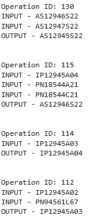
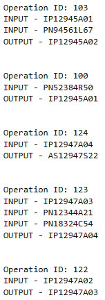
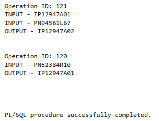

# USBD25 - List of product’s operations necessary for the production plan module.

### 1. User Story Description

>  As a Production Manager, I want to get a list of a product’s operations necessary for the production plan module.

### 2. Resolution
>**AC1:** Minimum expected requirement: demonstrated with data imported from the
legacy system.
> 
>**AC2:** A function should return a cursor with all product operations. When a part is a subproduct made at the factory, its list of operations
should be included. For each operation, the execution time, inputs and outputs
should be included.

>The first function, GetProductIDs, is designed to retrieve all product IDs associated with the given product (p_product_id) by navigating the BOO hierarchy. It uses a recursive common table expression to identify all related product IDs, including inputs and outputs of operations. The function returns a cursor containing the distinct set of product IDs.
>
>The second function, GetProductOperationIDs, retrieves all operation IDs related to a specific product. It performs a simple query on the Operation table to find operations where the given product is listed as the BOOProductProduct_ID. The result is returned as a cursor.
>
>The third function, GetOperationInputOuput, retrieves the inputs and outputs for a given operation ID (p_OPERATION_ID). It queries the BOO_INPUT and BOO_OUTPUT tables, returning a cursor with each part's role (input or output) and its part number.
>
>Finally, the anonymous PL/SQL block uses these functions to traverse and display the hierarchy of operations and their inputs/outputs for a given product. It begins by calling GetProductIDs with an initial product ID. For each product ID retrieved, it fetches the related operation IDs using GetProductOperationIDs. For every operation, it then calls GetOperationInputOuput to fetch and display all associated inputs and outputs.

    CREATE OR REPLACE FUNCTION GetProductIDs(p_product_id IN Product.Product_ID%TYPE)
    RETURN SYS_REFCURSOR
    IS
        result_cursor SYS_REFCURSOR;
    BEGIN
        OPEN result_cursor FOR
        WITH ProductIDs (BOOProductProduct_ID) AS (
            -- Main product operations
            SELECT o.BOOProductProduct_ID
            FROM Operation o
            WHERE o.BOOProductProduct_ID = p_product_id
            
            UNION ALL

            SELECT BI.PartPARTNUMBER
            FROM BOO_INPUT BI
            JOIN Operation O ON O.OPERATION_ID = BI.OperationOPERATION_ID
            JOIN ProductIDs pi ON pi.BOOProductProduct_ID = O.BOOProductProduct_ID
            WHERE BI.PartPARTNUMBER IN(
                    SELECT o.BOOProductProduct_ID
                    FROM Operation o
                )
            )
            SELECT DISTINCT BOOProductProduct_ID
            FROM ProductIDs;
        
        RETURN result_cursor;
    END;
    /
    
    
    CREATE OR REPLACE FUNCTION GetProductOperationIDs (p_product_id IN Product.Product_ID%TYPE)
    RETURN SYS_REFCURSOR
    IS
        result_cursor SYS_REFCURSOR;
    BEGIN
        OPEN result_cursor FOR
            SELECT DISTINCT o.OPERATION_ID
            FROM Operation o
            WHERE o.BOOProductProduct_ID = p_product_id;
        RETURN result_cursor;
    END;
    /
    
    CREATE OR REPLACE FUNCTION GetOperationInputOuput(p_OPERATION_ID IN Operation.OPERATION_ID%TYPE)
    RETURN SYS_REFCURSOR
    IS
        io_cursor SYS_REFCURSOR;
    BEGIN
        OPEN io_cursor FOR
            SELECT 'INPUT' AS IO_TYPE,
            CAST(PartPARTNUMBER AS VARCHAR2(255)) AS PartPARTNUMBER
            FROM BOO_INPUT
            WHERE OperationOPERATION_ID = p_OPERATION_ID
            
            UNION ALL
            
            SELECT 'OUTPUT' AS IO_TYPE,
            CAST(PartPARTNUMBER AS VARCHAR2(255)) AS PartPARTNUMBER
            FROM BOO_OUTPUT
            WHERE OperationOPERATION_ID = p_OPERATION_ID;
        RETURN io_cursor;
    END;
    /
    
    
    DECLARE
        operations SYS_REFCURSOR;
        products_ids SYS_REFCURSOR;
        op_id  Operation.OPERATION_ID%TYPE;
        p_id Product.Product_ID%TYPE;
    
        oi_cursor SYS_REFCURSOR;
        io_type VARCHAR2(255);  -- IO type (Input/Output)
        part VARCHAR2(255);  -- Part number
    BEGIN
        -- AS12945S22, AS12946S20
        products_ids := GetProductIDs('AS12945S22');
    
        LOOP
            FETCH products_ids INTO p_id ;
            EXIT WHEN products_ids%NOTFOUND;
    
            operations := GetProductOperationIDs(p_id);
    
            LOOP
                FETCH operations INTO op_id ;
                EXIT WHEN operations%NOTFOUND;
                
                DBMS_OUTPUT.PUT_LINE('Operation ID: ' || op_id);
    
                oi_cursor := GetOperationInputOuput(op_id);
    
                LOOP
                    FETCH oi_cursor INTO io_type, part;
                    EXIT WHEN oi_cursor%NOTFOUND;
                    
                    DBMS_OUTPUT.PUT_LINE(io_type || ' - ' || part);
                END LOOP;
                CLOSE oi_cursor;
                DBMS_OUTPUT.PUT_LINE(CHR(10));
            END LOOP;
            CLOSE operations;
        END LOOP;
        CLOSE products_ids;
    END;
    /

### 3. Resolution

>
>
>
>
>

>[See results in a CSV file](csv_result/USBD25.csv)

