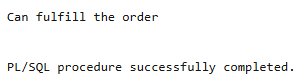

# USBD26 - Necessary materials and components in stock to fulfil a given order

### 1. User Story Description

> As a Production Manager, I want to know if we have the necessary materials and components in stock to fulfil a given order.

### 2. Resolution
>**AC1:** Minimum expected requirement: demonstrated with data imported from the
legacy system.

>The GetProductParts function retrieves all parts and their required quantities for a given operation, filtering out any items classified as products. It returns a cursor with the part numbers and their respective quantities. The CheckStock function checks whether the stock for a specific part is sufficient to meet the required quantity. It dynamically constructs and executes a query to ensure that the stock, after subtracting reserved quantities and considering the required amount, still exceeds the minimum stock level. If the stock is insufficient, the function returns false; otherwise, it returns true. Any exceptions, such as missing data, are handled with meaningful error messages.
>
>The anonymous block orchestrates the entire process. It begins by fetching all related product IDs for a given product, navigating its BOO hierarchy. For each product, it retrieves the associated operations. For every operation, it calls GetProductParts to fetch the list of required parts and their quantities. Using the CheckStock function, it verifies if the stock levels are sufficient for each part. If any part fails the check, it exits the process and marks the order as unfulfillable.
>
>At the end of the process, the block determines whether all checks passed. If any stock shortage was detected, it outputs a message indicating that the order cannot be fulfilled. Otherwise, it confirms that the stock is sufficient to proceed.

    CREATE OR REPLACE FUNCTION GetProductParts (p_operation_id IN Operation.OPERATION_ID%TYPE)
    RETURN SYS_REFCURSOR
    IS
        result_cursor SYS_REFCURSOR;
    BEGIN
        OPEN result_cursor FOR
            SELECT BI.PartPARTNUMBER, BI.QUANTITY
            FROM BOO_INPUT BI
            JOIN Part p on BI.PartPARTNUMBER = p.PARTNUMBER
            WHERE BI.OperationOPERATION_ID = p_operation_id
            AND p.Part_TypePART_TYPE NOT LIKE 'Product';
        RETURN result_cursor;
    END;
    /
    
    CREATE OR REPLACE FUNCTION CheckStock (
        p_PartPARTNUMBER IN Part.PARTNUMBER%TYPE,
        QUANTITY IN NUMBER
    )
    RETURN BOOLEAN
    IS
        v_exists NUMBER;
        part_type Part.Part_TypePART_TYPE%TYPE;
        sql_query VARCHAR2(4000);
        resrv NUMBER;
    BEGIN
        SELECT Part_TypePART_TYPE
        INTO part_type
        FROM Part
        WHERE PARTNUMBER = p_PartPARTNUMBER;
        
        SELECT RESERVED INTO resrv
        FROM Reserved
        WHERE PartPARTNUMBER = p_PartPARTNUMBER;
    
        sql_query := 'SELECT COUNT(*) FROM ' || part_type || ' WHERE PartPARTNUMBER = :1 AND (STOCK - :2) > (MIN_STOCK + :3)';
    
        EXECUTE IMMEDIATE sql_query INTO v_exists USING p_PartPARTNUMBER, QUANTITY, resrv;
    
        IF v_exists > 0 THEN
            RETURN TRUE;
        ELSE
            RETURN FALSE;
        END IF;
    
        EXCEPTION
            WHEN NO_DATA_FOUND THEN
                RAISE_APPLICATION_ERROR(-20001, 'NO DATA FOUND' || SQLERRM);
                RETURN FALSE;
            WHEN OTHERS THEN
                RAISE_APPLICATION_ERROR(-20001, SQLERRM);
                RETURN FALSE;
    END;
    /
    
    
    DECLARE
        ops SYS_REFCURSOR;
        part_stock SYS_REFCURSOR;
        prod_ids SYS_REFCURSOR;
        op_id  BOO_INPUT.OperationOPERATION_ID%TYPE;
        p_id Product.Product_ID%TYPE;
        part_id Part.PARTNUMBER%TYPE;
        Quantity number;
    
        v_not_exists number;
        is_empty BOOLEAN := FALSE;
        flag BOOLEAN := FALSE;
    BEGIN
        --AS12945S22, AS12946S20
        prod_ids := GetProductIDs('AS12946S20');
    
        LOOP
            FETCH prod_ids INTO p_id ;
    
            IF prod_ids%NOTFOUND AND flag = FALSE THEN
                is_empty := TRUE;
                v_not_exists := 1;
            END IF;
    
            EXIT WHEN prod_ids%NOTFOUND;
            
            ops := GetProductOperationIDs(p_id);
    
            flag := TRUE;
    
            LOOP
                FETCH ops INTO op_id ;
                EXIT WHEN ops%NOTFOUND;
    
                part_stock := GetProductParts(op_id);
    
                LOOP
                    FETCH part_stock INTO part_id, Quantity ;
                    EXIT WHEN part_stock%NOTFOUND;
    
                    IF NOT CheckStock(part_id, Quantity) THEN
                        v_not_exists := 1;
                    END IF;
    
                    IF v_not_exists = 1 THEN
                        EXIT;
                    END IF;
    
                END LOOP;
                CLOSE part_stock;
                IF v_not_exists = 1 THEN
                    EXIT;
                END IF;
    
            END LOOP;
            CLOSE ops;
            IF v_not_exists = 1 THEN
                EXIT;
            END IF;
    
        END LOOP;
        CLOSE prod_ids;
    
        IF v_not_exists != 0 THEN
            DBMS_OUTPUT.PUT_LINE('Cannot fulfill the order' );
        ELSE
            DBMS_OUTPUT.PUT_LINE('Can fulfill the order' );
        END IF;
    
        IF is_empty = TRUE THEN
            DBMS_OUTPUT.PUT_LINE('Product not found' );
        END IF;
    END;
    /

### 3. Resolution

>

>[See results in a CSV file](csv_result/USBD26.csv)

