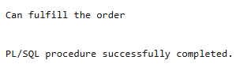

# USBD27 - Reserve the necessary materials and components to fulfil a given order

### 1. User Story Description

>  As a Production Manager, I want to reserve the necessary materials and components to fulfil a given order. The reserved materials and components should be registered in the database, but not automatically deducted from stock. The reservation should be created only if the whole order can be fulfilled.

### 2. Resolution
>**AC1:** Minimum expected requirement: demonstrated with data imported from the
legacy system.
> 
>**AC2:** The reserved materials and components
should be registered in the database, but not automatically deducted from stock.
The reservation should be created only if the whole order can be fulfilled.

>The first part is the function GetOrderProducts This function retrieves all the products associated with a specific order It takes an order ID as input and returns a cursor containing the product IDs linked to the order in the Order Products table The function uses a SELECT statement to join the Product and Order Products tables filtered by the given order ID The returned cursor is later used to process the order's products
>
>Next is the procedure VerifyReserved Its purpose is to ensure that a part exists in the Reserved table If no entry is found for the part it inserts a new record with a RESERVED value of zero The procedure checks the Reserved table for the part using a SELECT COUNT statement If the count is zero it performs an INSERT to create the record Exception handling is included to raise a custom error in case of unexpected issues
>
>The function UpdateReserved manages the reserved quantity of a part while respecting stock constraints It starts by determining the part type from the Part table A dynamic SQL query retrieves stock and minimum stock values from the appropriate table Component or Raw Material The function then calls VerifyReserved to ensure the part exists in the Reserved table Finally it attempts to update the reserved quantity If the stock cannot cover the requested quantity the function raises an error Exception handling manages issues such as missing data or execution failures
>
>The main logic is in the anonymous block which orchestrates the order processing The block begins by setting the transaction isolation level to SERIALIZABLE to ensure consistency It then retrieves the products in the order using GetOrderProducts which returns a cursor The block iterates through the products fetching related product IDs operations and parts required for each operation At each level it calls relevant functions like GetProductIDs GetProductOperationIDs and GetProductParts to obtain necessary data
>
>For each part required by an operation the block calls UpdateReserved to update the reserved quantity If UpdateReserved determines that the stock is insufficient the process exits early rolls back the transaction and logs that the order cannot be fulfilled If the order contains no products the block logs a message stating the order is empty
>
>Finally the block commits or rolls back the transaction based on whether all parts had sufficient stock A success message is logged if the transaction is committed Otherwise a rollback ensures no partial changes are made and an error message is logged

    CREATE OR REPLACE FUNCTION GetOrderProducts(
        p_OrderID IN "Order".ORDER_ID%TYPE
    )
    RETURN SYS_REFCURSOR
    IS
        result_cursor SYS_REFCURSOR;
    BEGIN
        OPEN result_cursor FOR
            SELECT p.Product_ID
            FROM Product p
            JOIN Order_Products op ON p.Product_ID = op.ProductProduct_ID
            WHERE op.OrderORDER_ID = p_OrderID;
        RETURN result_cursor;
    END;
    /
    
    CREATE OR REPLACE PROCEDURE VerifyReserved (
        p_PartPARTNUMBER IN Part.PARTNUMBER%TYPE
    )
    IS
        v_exists NUMBER;
    BEGIN
        -- Check if the part exists in the Reserved table
        SELECT COUNT(*)
        INTO v_exists
        FROM Reserved
        WHERE PartPARTNUMBER = p_PartPARTNUMBER;
    
        -- If the part is not found, insert it with RESERVED = 0
        IF v_exists = 0 THEN
            INSERT INTO Reserved (PartPARTNUMBER, RESERVED)
            VALUES (p_PartPARTNUMBER, 0);
        END IF;
    
        EXCEPTION
            WHEN OTHERS THEN
                RAISE_APPLICATION_ERROR(-20001, 'Error in verifying or inserting reserved part: ' || SQLERRM);
    END ;
    /
    
    
    
    CREATE OR REPLACE FUNCTION UpdateReserved (
        p_PartPARTNUMBER IN Part.PARTNUMBER%TYPE,
        QUANTITY IN NUMBER
    )
    RETURN BOOLEAN
    IS
        part_type Part.Part_TypePART_TYPE%TYPE;
        sql_query VARCHAR2(255);
        stk NUMBER;
        min_stk NUMBER;
    BEGIN
        BEGIN
            -- Select Part_Type from the Part table
            SELECT Part_TypePART_TYPE
            INTO part_type
            FROM Part
            WHERE PARTNUMBER = p_PartPARTNUMBER;
    
            -- Build dynamic SQL query to select stock information
            sql_query := 'SELECT STOCK, MIN_STOCK FROM ' || part_type || ' WHERE PartPARTNUMBER = :p_PartPARTNUMBER';
    
            -- Execute the dynamic SQL query to retrieve stock and min_stock values
            EXECUTE IMMEDIATE sql_query INTO stk, min_stk USING p_PartPARTNUMBER;
    
            VerifyReserved(p_PartPARTNUMBER);
            
            -- Update the Reserved table based on stock and quantity values
            UPDATE Reserved
            SET RESERVED = RESERVED + QUANTITY
            WHERE PartPARTNUMBER = p_PartPARTNUMBER
            AND stk - QUANTITY >= (RESERVED + min_stk);
    
            -- If no rows were updated, raise an error for insufficient stock
            IF SQL%ROWCOUNT = 0 THEN
                RAISE_APPLICATION_ERROR(-20001, 'Insufficient stock to complete the operation.');
                RETURN FALSE;
            END IF;
    
            RETURN TRUE;
    
        EXCEPTION
            WHEN NO_DATA_FOUND THEN
                RAISE_APPLICATION_ERROR(-20001, 'No part found.');
                RETURN FALSE;
    
            WHEN OTHERS THEN
                RAISE_APPLICATION_ERROR(-20001, 'Error Code: ' || SQLCODE || ' Error Message: ' || SQLERRM);
                RETURN FALSE;
        END;
    END;
    /
    
    DECLARE
        order_product_ids SYS_REFCURSOR;
        operations SYS_REFCURSOR;
        part_stock SYS_REFCURSOR;
        products_ids SYS_REFCURSOR;
    
        o_p_id Product.Product_ID%TYPE;
        op_id  BOO_INPUT.OperationOPERATION_ID%TYPE;
        p_id Product.Product_ID%TYPE;
        part_id Part.PARTNUMBER%TYPE;
        Quantity number(10);
    
        v_not_exists number;
        is_empty_order BOOLEAN := FALSE;
    BEGIN
        EXECUTE IMMEDIATE 'SET TRANSACTION ISOLATION LEVEL SERIALIZABLE';
    
        order_product_ids := GetOrderProducts(5);
    
        LOOP 
            FETCH order_product_ids INTO o_p_id ;
    
            IF order_product_ids%NOTFOUND THEN
                is_empty_order := TRUE;
                v_not_exists := 1;
            END IF;
            
            EXIT WHEN order_product_ids%NOTFOUND;
    
    
            products_ids := GetProductIDs(o_p_id);
            
            LOOP
                FETCH products_ids INTO p_id ;
                EXIT WHEN products_ids%NOTFOUND;
    
                operations := GetProductOperationIDs(p_id);
            
                LOOP
                    FETCH operations INTO op_id ;
                    EXIT WHEN operations%NOTFOUND;
            
                    part_stock := GetProductParts(op_id);
            
                    LOOP
                        FETCH part_stock INTO part_id, Quantity ;
                        EXIT WHEN part_stock%NOTFOUND;
            
                        IF NOT UpdateReserved(part_id, Quantity) THEN
                            v_not_exists := 1;
                        END IF;
            
                        IF v_not_exists = 1 THEN
                            EXIT;
                        END IF;
                        DBMS_OUTPUT.PUT_LINE('Inside2');
            
                    END LOOP;
                    CLOSE part_stock;
                        
                    IF v_not_exists = 1 THEN
                        EXIT;
                    END IF;
            
                END LOOP;
                CLOSE operations;
                IF v_not_exists = 1 THEN
                    EXIT;
                END IF;
                
            END LOOP;
            CLOSE products_ids;
        END LOOP;
        CLOSE order_product_ids;
    
        IF v_not_exists != 0 THEN
            DBMS_OUTPUT.PUT_LINE('Cannot fulfill the order' );
            ROLLBACK;
        ELSE
            DBMS_OUTPUT.PUT_LINE('Can fulfill the order' );
            COMMIT;
        END IF;
        
        IF is_empty_order = TRUE THEN
            DBMS_OUTPUT.PUT_LINE('Order not found' );
        END IF;
    END;
    /
    
    UPDATE Reserved
    SET RESERVED = 5
    WHERE PartPARTNUMBER = 'PN18544A21';

    --Select RESERVED FROM RESERVED WHERE PartPARTNUMBER = 'PN18544A21';
    
    INSERT INTO Part (PARTNUMBER, DESCRIPTION, Part_TypePART_TYPE) VALUES ('AS99999S99', 'teste', 'Product');
    INSERT INTO Product (PRODUCT_ID, Prod_FamilyFAMILY_ID, NAME, DESCRIPTION)
    VALUES ('AS99999S99', 130, 'teste', 'teste');
    
    INSERT INTO BOO (ProductPRODUCT_ID) VALUES ('AS99999S99');
    
    INSERT INTO Operation (OPERATION_ID, DESCRIPTION, EXPECTEDTIME, BOOProductPRODUCT_ID, Operation_TYPEOPTYPE_ID, NEXTSTEP)
    VALUES (999, 'Operation 130 description', 240, 'AS99999S99', 5663, NULL);
    
    INSERT INTO BOO_INPUT (OperationOPERATION_ID, PartPARTNUMBER, QUANTITY, UNIT) VALUES (999, 'PN18544A21', 1, 'unit');
    INSERT INTO BOO_INPUT (OperationOPERATION_ID, PartPARTNUMBER, QUANTITY, UNIT) VALUES (999, 'PN52384R50', 1, 'unit');
    INSERT INTO BOO_OUTPUT (OperationOPERATION_ID, PartPARTNUMBER, QUANTITY, UNIT) VALUES (999, 'AS99999S99', 1, 'unit');

### 3. Resolution

>

>[See results in a CSV file](csv_result/USBD27.csv)

