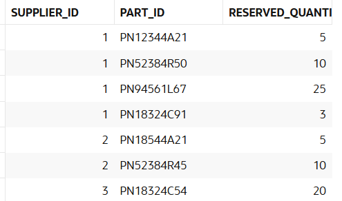

# USBD28 - List of all reserved materials and components, their quantity and the ID of the supplier

### 1. User Story Description

>  As a Production Manager, I want to have a list of all reserved materials and components, their quantity and the ID of the supplier.

### 2. Resolution
>**AC1:** Minimum expected requirement: demonstrated with data imported from the
legacy system.

>This query retrieves a combined list of components and raw materials, along with their associated suppliers and reserved quantities, for items with reservations greater than zero. The results are sorted by supplier ID.
>
>The first part of the query focuses on components. It selects the supplier ID (SupplierSupplierID) from the Supplier_Part table, the part ID (PartPARTNUMBER) from the Component table, and the reserved quantity (RESERVED) from the RESERVED table. These tables are joined based on the part number (PartPARTNUMBER) to establish relationships between components, their suppliers, and reserved quantities. The query filters results to include only components with a reserved quantity greater than zero.
>
>The second part of the query performs a similar operation for raw materials. It retrieves the same fields—supplier ID, part ID, and reserved quantity—but uses the Raw_Material table instead of the Component table. As in the first part, it includes only raw materials with reserved quantities greater than zero.
>
>The UNION ALL operator combines the results of both queries, keeping all entries without removing duplicates. The final result is ordered by the supplier ID to group items by their associated supplier. This query provides a consolidated view of all reserved items, both components and raw materials, along with their suppliers, facilitating inventory and supplier management.

    SELECT 
        sp.SupplierSupplierID AS Supplier_ID,
        c.PartPARTNUMBER AS Part_ID,
        r.RESERVED AS Reserved_Quantity
    FROM
        Component c
    JOIN
        Supplier_Part sp ON c.PartPARTNUMBER = sp.PartPARTNUMBER
    JOIN
        RESERVED r ON c.PartPARTNUMBER = r.PartPARTNUMBER
    WHERE
        r.RESERVED > 0
    UNION ALL
    SELECT
        sp.SupplierSupplierID AS Supplier_ID,
        rm.PartPARTNUMBER AS Part_ID,
        r.RESERVED AS Reserved_Quantity
    FROM
        Raw_Material rm
    JOIN
        Supplier_Part sp ON rm.PartPARTNUMBER = sp.PartPARTNUMBER
    JOIN
        RESERVED r ON rm.PartPARTNUMBER = r.PartPARTNUMBER
    WHERE
        r.RESERVED > 0
    ORDER BY SUPPLIER_ID;

### 3. Resolution

>

>[See results in a CSV file](csv_result/USBD28.csv)

