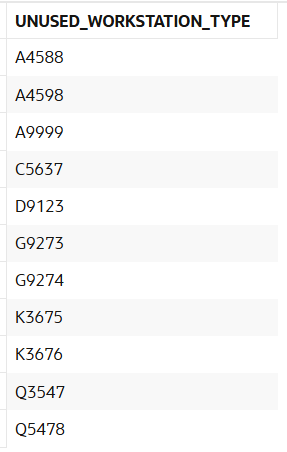

# USBD29 - Workstation types not used in any BOO

### 1. User Story Description

>  As a Factory Manager, I want to know the workstation types not used in any BOO.

### 2. Resolution
>**AC1:** Minimum expected requirement: demonstrated with data imported from the
legacy system.

>This query identifies workstation types that are not currently associated with any operations. It uses left joins and a filtering condition to find unused workstation types.
>
>The query begins by selecting workstation type IDs (WS_TYPE_ID) from the Workstation_Type table. It joins the Workstation_Type_Operation_TYPE table on the WS_TYPE_ID to establish a relationship between workstation types and operation types. It then performs another left join with the Operation table to associate operation types with actual operations.
>
>The key part of the query is the WHERE clause, which checks if the operation type ID (Operation_TYPEOPTYPE_ID) from the Operation table is NULL. This condition ensures that only workstation types not linked to any operations are included in the results.
>
>The query uses a GROUP BY clause to group results by the workstation type ID. This is necessary when aggregating or deduplicating data across joins, although in this case, there is no aggregation function. Finally, the results are sorted in ascending order by the workstation type ID.

    INSERT INTO Workstation_Type (WS_TYPE_ID, NAME, MAX_EXECUTIONTIME, SETUP_TIME) VALUES ('A9999', '600t cold forging stamping press', 120, 30);
    INSERT INTO Workstation_Type_Operation_TYPE (Workstation_TypeWS_TYPE_ID, Operation_TYPEOPTYPE_ID) VALUES ('A9999', 5647);
    INSERT INTO Operation (OPERATION_ID, DESCRIPTION, EXPECTEDTIME, BOOProductPRODUCT_ID, Operation_TYPEOPTYPE_ID, NEXTSTEP)
    VALUES (999, 'Pot handles riveting', 120, 'AS99999S99', 5647, NULL);
    
    SELECT
        wt.WS_TYPE_ID AS Unused_Workstation_Type
    FROM
        Workstation_Type wt
    LEFT JOIN
        Workstation_Type_Operation_TYPE wtot ON wt.WS_TYPE_ID = wtot.Workstation_TypeWS_TYPE_ID
    LEFT JOIN
        Operation o ON wtot.Operation_TYPEOPTYPE_ID = o.Operation_TYPEOPTYPE_ID
    WHERE
        o.Operation_TYPEOPTYPE_ID IS NULL
    GROUP BY
        wt.WS_TYPE_ID
    ORDER BY
        wt.WS_TYPE_ID;
    

### 3. Resolution

>

>[See results in a CSV file](csv_result/USBD29.csv)

