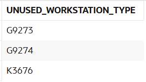

# USBD29 - Workstation types not used in any BOO

### 1. User Story Description

>  As a Factory Manager, I want to know the workstation types not used in any BOO.

### 2. Resolution
>**AC1:** Minimum expected requirement: demonstrated with data imported from the
legacy system.
> 
>**AC2:** A function should return a cursor with all the product
parts and their quantity. The individual components should be included when a
part is a subproduct made at the factory

>This script defines a PL/SQL function called list_parts_used_product, which returns a cursor containing a list of parts used by a specific product, along with their quantities. The function accepts a product_id as input and opens a SYS_REFCURSOR to retrieve the relevant data.
>
>The first part of the query selects parts directly associated with the product by joining the BOO_INPUT and Operation tables. It sums the quantities for each part number and groups the results by part number.
>
>The second part of the query handles parts related to the product indirectly. It selects parts from the BOO_OUTPUT table, ensuring that parts are not linked directly to the product but are part of a more complex relationship. The query joins BOO_OUTPUT and BOO_INPUT and filters based on a subquery that identifies parts associated with the subproducts through specific operations. This query also sums the quantities and groups them by part number.

    INSERT INTO Workstation_Type (WS_TYPE_ID, NAME, MAX_EXECUTIONTIME, SETUP_TIME) VALUES ('A9999', '600t cold forging stamping press', 120, 30);
    INSERT INTO Workstation_Type_Operation_TYPE (Workstation_TypeWS_TYPE_ID, Operation_TYPEOPTYPE_ID) VALUES ('A9999', 5647);
    INSERT INTO Operation (OPERATION_ID, DESCRIPTION, EXPECTEDTIME, BOOProductPRODUCT_ID, Operation_TYPEOPTYPE_ID, NEXTSTEP)
    VALUES (999, 'Pot handles riveting', 120, 'AS99999S99', 5647, NULL);

    SELECT
        wt.WS_TYPE_ID AS Unused_Workstation_Type
    FROM
        Workstation_Type wt
    LEFT JOIN
        Workstation_Type_Operation_TYPE wtot
    ON
        wt.WS_TYPE_ID = wtot.Workstation_TypeWS_TYPE_ID
    LEFT JOIN
        Operation o
    ON
        wtot.Operation_TYPEOPTYPE_ID = o.Operation_TYPEOPTYPE_ID
    WHERE
        o.Operation_TYPEOPTYPE_ID IS NULL;

### 3. Resolution

>

>[See results in a CSV file](csv_result/USBD29.csv)

