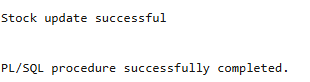

# USBD30 - Use/consume a material/component and deduct the given amount from the stock

### 1. User Story Description

>  As a Factory Manager, I want to use/consume a material/component, i.e. to deduct a given amount from the stock. The operation should not be allowed if the remaining stock falls below the currently reserved quantity.

### 2. Resolution
>**AC1:** Minimum expected requirement: demonstrated with data imported from the
legacy system.
> 
>**AC2:** A function should return a cursor with all the product
parts and their quantity. The individual components should be included when a
part is a subproduct made at the factory

>The VerifyReserved procedure is responsible for ensuring that a part exists in the Reserved table. It takes a part number as input, checks if the part is already recorded in the Reserved table, and if not, inserts a new entry with a RESERVED value of 0. This guarantees that every part being processed has a corresponding record in the Reserved table, even if it hasn’t been reserved yet. If any errors occur, such as constraint violations, the procedure raises a custom error message.
>
>The update_stock function is more complex and handles the actual stock updates for parts. It is designed to update stock levels for a specific part based on its type (either a Component or Raw_Material) and the quantity specified. Before updating the stock, it first checks the part’s type by querying the Part table. Then it calls the VerifyReserved procedure to ensure the part is represented in the Reserved table. Afterward, the function checks the reserved quantity for the part and verifies that the part type is either a Component or Raw_Material.
>
>If the part is a Component, the function updates the stock in the Component table by subtracting the specified amount. However, it only allows this if the remaining stock after the subtraction is greater than or equal to the sum of the reserved quantity and the minimum stock level (MIN_STOCK). If the part is a Raw_Material, it similarly updates the stock in the Raw_Material table, ensuring the same constraints are met. If the part does not belong to either of these categories, the function raises an error. If no rows are updated due to insufficient stock, it raises an error as well.
>
>The function also sets the transaction isolation level to serializable, which ensures that the transaction is executed in a manner that prevents conflicts with other concurrent transactions. If any error occurs during the execution, the transaction is rolled back, and the error message is returned. Otherwise, the transaction is committed, and the function returns a success message indicating the stock update was successful.
>
>Finally, the anonymous block demonstrates how to use the update_stock function. It calls the function with a specific part number and the amount to be subtracted from the stock. The result of the function is then printed out, indicating whether the stock update was successful or if an error occurred.
>
>This code is designed to manage and update stock levels for parts efficiently, ensuring that reserved quantities are respected, stock levels are checked before updates, and the process follows strict data integrity rules. It handles both components and raw materials differently, and uses transaction control to maintain consistency throughout the operation.

    CREATE OR REPLACE PROCEDURE VerifyReserved (
        p_PartPARTNUMBER IN Part.PARTNUMBER%TYPE
    )
    IS
        v_exists NUMBER;
    BEGIN
        -- Check if the part exists in the Reserved table
        SELECT COUNT(*)
        INTO v_exists
        FROM Reserved
        WHERE PartPARTNUMBER = p_PartPARTNUMBER;
    
        -- If the part is not found, insert it with RESERVED = 0
        IF v_exists = 0 THEN
            INSERT INTO Reserved (PartPARTNUMBER, RESERVED)
            VALUES (p_PartPARTNUMBER, 0);
        END IF;
    
        EXCEPTION
            WHEN OTHERS THEN
            -- Handle any errors (e.g., integrity constraints)
            RAISE_APPLICATION_ERROR(-20001, 'Error in verifying or inserting reserved part: ' || SQLERRM);
    END;
    /
    
    CREATE OR REPLACE FUNCTION update_stock (
        p_PartPARTNUMBER IN Part.PARTNUMBER%TYPE,
        p_Amount IN NUMBER)
    RETURN VARCHAR2
    IS
        v_Part_Type VARCHAR2(50);
        p_reserved Reserved.PartPARTNUMBER%TYPE;
    BEGIN
        EXECUTE IMMEDIATE 'SET TRANSACTION ISOLATION LEVEL SERIALIZABLE';
        
        BEGIN
            SELECT Part_TypePART_TYPE
            INTO v_Part_Type
            FROM Part
            WHERE PARTNUMBER = p_PartPARTNUMBER;
    
            VerifyReserved(p_PartPARTNUMBER);
    
            SELECT RESERVED
            INTO p_reserved
            FROM Reserved
            WHERE PartPARTNUMBER = p_PartPARTNUMBER;
    
                IF v_Part_Type = 'Component' THEN
                    UPDATE Component
                    SET STOCK = STOCK - p_Amount
                    WHERE PartPARTNUMBER = p_PartPARTNUMBER
                    AND STOCK - p_Amount >= (p_reserved+MIN_STOCK);
    
                    IF SQL%ROWCOUNT = 0 THEN
                        RAISE_APPLICATION_ERROR(-20001, 'Insufficient stock to complete the operation.');
                    END IF;
    
                ELSIF v_Part_Type = 'Raw_Material' THEN
                    UPDATE Raw_Material
                    SET STOCK = STOCK - p_Amount
                    WHERE PartPARTNUMBER = p_PartPARTNUMBER
                    AND STOCK - p_Amount >= (p_reserved+MIN_STOCK);
    
                    IF SQL%ROWCOUNT = 0 THEN
                        RAISE_APPLICATION_ERROR(-20001, 'Insufficient stock to complete the operation.');
                    END IF;
    
                ELSE
                    RAISE_APPLICATION_ERROR(-20002, 'The following part was not a component or material');
                END IF;
            END;
        COMMIT;
    
        RETURN 'Stock update successful';
    
        EXCEPTION
            WHEN OTHERS THEN
                ROLLBACK;
                RETURN 'Error: ' || SQLERRM;
    END;
    /
    
    
    DECLARE
        result VARCHAR2(100);
    BEGIN
        --PN12344A21 50 10 5
        result := update_stock('PN12344A21', 20);
        DBMS_OUTPUT.PUT_LINE(result);
    END;
    /

### 3. Resolution

>

>[See results in a CSV file](csv_result/USBD30.csv)

