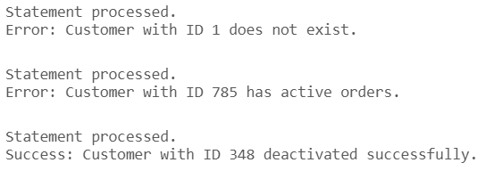

# USBD18 -  Deactivate a customer from the system

### 1. User Story Description

>  As a Production Manager, I want to deactivate a customer from the
system

### 2. Resolution
>**AC1:** Minimum expected requirement: demonstrated with data imported from the
   legacy system.
> 
>**AC2:** A function should be used to deactivate the customer
and return success or an error. A customer with orders that have not yet been
delivered/fulfilled cannot be deactivated.

      CREATE OR REPLACE FUNCTION deactivate_costumer(p_costumer_id Costumer.COSTUMER_ID%TYPE)
      RETURN VARCHAR2
      IS
         v_exists NUMBER(1);  -- Variable to check if the customer exists and is active
         result_message varchar2(255);
      BEGIN
         SELECT COUNT(1)
         INTO v_exists
         FROM "Order" O
         WHERE O.CostumerCOSTUMER_ID = p_costumer_id;

          IF v_exists = 0 THEN
              RETURN 'Error: Customer with ID ' || p_costumer_id || ' has orders.';
          END IF;
          
          SELECT COUNT(1)
          INTO v_exists
          FROM Costumer C
          WHERE C.COSTUMER_ID = p_costumer_id;
      
          IF v_exists = 0 THEN
              RETURN 'Error: Customer with ID ' || p_costumer_id || ' does not exist.';
          END IF;
      
          BEGIN
              INSERT INTO "Deactivated Costumers"(CostumerCOSTUMER_ID) VALUES (p_costumer_id);
      
              result_message := 'Success: Order with ID ' || p_costumer_id || ' deactivated successfully.';
              RETURN result_message;
      
          EXCEPTION
              WHEN OTHERS THEN
                  RETURN 'Error: ' || SQLERRM;
          END;	
      END;
      /
      
      DECLARE
         result_message VARCHAR2(255);
      BEGIN
         result_message := deactivate_costumer(785);
         DBMS_OUTPUT.PUT_LINE(result_message);
      END;
      /

### 3. Resolution

>

>[See results in a CSV file](csv_result/USBD18.csv)

